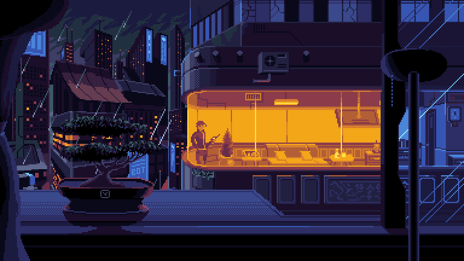

# Кирилл Стяжкин 👋
### Frontend-developer • React · TypeScript · Next.js

  &nbsp;
  &nbsp;
  

📍 Астана — Кокшетау

---

## 🧑‍💻 О себе

Я фронтенд-разработчик из Казахстана, ответственный, коммуникабельный и постоянно развивающийся в профессии.

Специализируюсь на создании производительных веб-приложений с использованием React, Next.js, JavaScript и TypeScript. Уверенно работаю с HTML и CSS, включая Tailwind CSS и SCSS.

Имею опыт построения масштабируемой архитектуры клиентских приложений: управление состоянием через Zustand, работа с серверными данными через TanStack Query, сложные формы с валидацией через React Hook Form и Zod. Отдельное внимание уделяю производительности и SEO — использую SSR и ISR в Next.js для быстрой отдачи контента и хорошей индексации.

Также имею опыт реализации real-time функциональности через WebSockets, безопасной авторизации на JWT и OAuth, а также внедрения многоязычности (i18n) в приложениях.

---

## 🛠️ Стек и инструменты

  

---

## 💼 Опыт работы

<strong>🟢 Frontend-developer — Shokan Ualihanov University (06.2025 – наст. время)</strong>

 

**Сайт приемной комиссии**
Стек: `Next.js` `Strapi CMS` `i18next` `SSR` `ISR`

- Реализация гибридного рендеринга: SSR для динамических страниц и ISR для мгновенной отдачи контента без пересборки проекта
- Интеграция с Headless CMS (Strapi): проектирование структуры контентных типов и оптимизация API-запросов
- Оптимизация SEO и Performance с помощью встроенных инструментов Next.js (Image, Font, Link)
- Разработка библиотеки переиспользуемых UI-компонентов, синхронизированных с CMS

**Главный сайт**
Стек: `Native HTML/CSS/JS` `Bootstrap` `Django Templates`

- Масштабный редизайн интерфейса и перенос макетов в чистый современный HTML/CSS код
- Интеграция фронтенд-логики в Django Templates с сохранением серверных тегов
- Адаптивная верстка и рефакторинг legacy JS-кода
- Совместная работа с Python-разработчиками по выводу данных из моделей

<strong>🔵 Frontend-developer — MirCode (07.2024 – 06.2025)</strong>

 

**Rento-tg-app**
Стек: `React` `TypeScript` `TG Web SDK` `WebSockets` `TanStack Query`

- Разработка архитектуры Mini App с интеграцией TG Web SDK
- Real-time взаимодействие через WebSockets — мгновенное обновление интерфейса без перезагрузки страниц
- Оптимизация работы с серверным состоянием через TanStack Query (кэширование, фоновая синхронизация)
- Построение сложных форм с React Hook Form и валидацией через Zod
- Внедрение интернационализации (i18n) с автоопределением локали
- Реализация защищенной авторизации: JWT (access/refresh tokens), безопасное хранение сессий

---

## 🎓 Образование

**Бакалавр — Информационные системы**
2023 – наст. время

---

## 📈 Навыки

Развернуть полный список навыков

 

- React
- TypeScript
- Tailwind CSS, SCSS
- Shadcn UI, HERO UI, Material UI
- TanStack Query, TanStack Router
- React Router
- Zustand
- JWT, OAuth
- Git
- Axios
- i18n
- React Hook Form
- Zod
- Vue

---

## 🗣️ Языки

- 🇷🇺 Русский — C1
- 🇬🇧 Английский — B1

---

## 📫 Контакты

